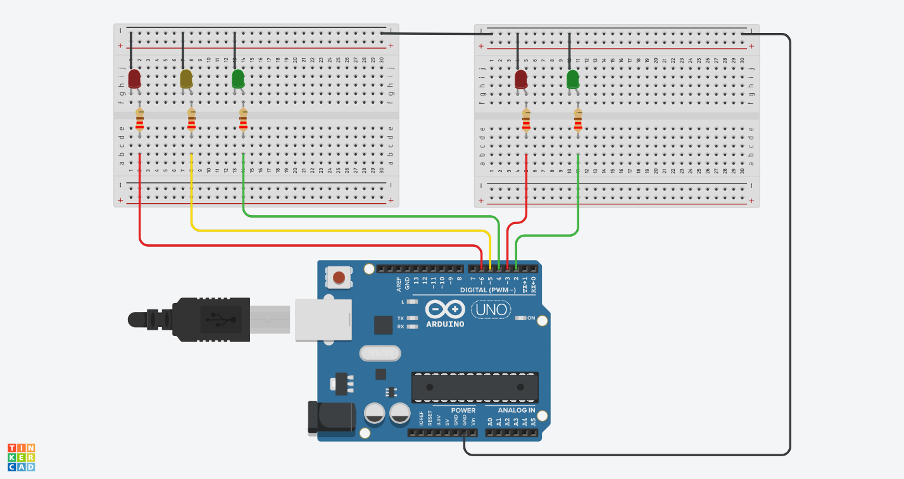

# Traffic Light

Arduino sketches for building a traffic light.

Refer to [this Medium publication](https://medium.com/@mjamado/electronics-and-programming-for-kids-make-a-traffic-light-9ed24dacb9ec) for walkthrough and everything necessary.

## Components necessary

* Arduino - most of the versions will do;
* 2 × red led
* 2 × green led
* 1 × yellow led
* 5 × 220Ω resistors
* Assortment of jumper cables
* One or two breadboards

## Assembly

## Author

**Marco Amado** - [DreamsInCode](http://www.dreamsincode.com)

## License

[Creative Commons BY-NC-SA 4.0 International](https://creativecommons.org/licenses/by-nc-sa/4.0/)